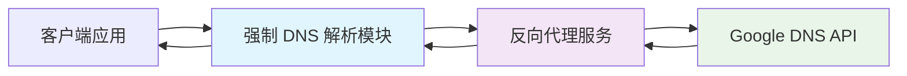

# DNS 强制解析实现指南

## 概述

本文档详细介绍如何在 `dnsResolver.mjs` 中实现强制 DNS 解析功能，确保在网络受限环境下仍能正常进行 DNS 查询。

## 强制 DNS 解析原理

### 什么是强制 DNS 解析？

强制 DNS 解析是指通过特定的网络代理或中转服务，绕过本地网络限制，强制将 DNS 请求路由到指定的解析服务器。这种方法特别适用于：

- 🚫 网络环境限制 DNS 查询
- 🌍 需要访问特定地区的 DNS 服务
- 🔧 绕过防火墙或网络过滤
- 🛡️ 增强 DNS 查询的隐私性和安全性

### 技术实现原理

1. **代理中转**: 通过反向代理服务转发 DNS 请求
2. **URL 封装**: 将 DNS API 请求封装在代理服务的 URL 中
3. **IP 强制映射**: 强制将代理域名解析到特定 IP 地址

## 实现架构



## 核心实现代码

### 1. 默认强制解析配置

```javascript
export async function resolveDNS(
  domain,
  type = "AAAA",
  resolverUrl = "https://fresh-reverse-proxy-middle.masx201.dpdns.org/token/4yF6nSCifSLs8lfkb4t8OWP69kfpgiun/https/dns.google/resolve",
) {
  // 实现代码...
}
```

**关键组件解析：**

- **代理服务**: `fresh-reverse-proxy-middle.masx201.dpdns.org`
- **认证令牌**: `4yF6nSCifSLs8lfkb4t8OWP69kfpgiun`
- **目标服务**: `dns.google/resolve` (Google DNS API)

### 2. URL 构建逻辑

```javascript
// 2. 构建请求 URL
const url = new URL(resolverUrl);
url.searchParams.append("name", domain);
url.searchParams.append("type", type);
```

**URL 结构分析：**
```
https://[代理服务]/token/[认证令牌]/https://[目标服务]?name=[域名]&type=[记录类型]
```

### 3. 错误处理机制

```javascript
try {
  const response = await fetch(url);
  
  if (!response.ok) {
    throw new Error(
      `DNS API 请求失败: ${response.status} ${response.statusText} ${response.url}`
    );
  }
  
  const data = await response.json();
  return data;
} catch (error) {
  if (error instanceof Error) {
    throw new Error(`DNS 解析过程中发生错误: ${error.message}`);
  }
  throw new Error("DNS 解析时发生未知错误");
}
```

## 高级配置选项

### 1. 自定义代理服务

```javascript
import { resolveDNS } from './dnsResolver.mjs';

// 使用不同的代理服务
const customProxy = "https://your-proxy-server.com/token/YOUR_TOKEN/https/dns.google/resolve";

async function forcedResolution() {
  try {
    const result = await resolveDNS('example.com', 'AAAA', customProxy);
    console.log('强制解析结果:', result);
  } catch (error) {
    console.error('强制解析失败:', error.message);
  }
}
```

### 2. 多代理故障转移

```javascript
const proxyList = [
  "https://proxy1.example.com/token/TOKEN1/https://dns.google/resolve",
  "https://proxy2.example.com/token/TOKEN2/https://dns.google/resolve",
  "https://proxy3.example.com/token/TOKEN3/https://dns.google/resolve"
];

async function resolveWithFallback(domain, type = 'AAAA') {
  for (const proxy of proxyList) {
    try {
      const result = await resolveDNS(domain, type, proxy);
      return result;
    } catch (error) {
      console.warn(`代理 ${proxy} 失败，尝试下一个...`);
      continue;
    }
  }
  throw new Error('所有代理服务均不可用');
}
```

### 3. 代理服务健康检查

```javascript
async function checkProxyHealth(proxyUrl) {
  try {
    // 测试解析一个常见域名
    const result = await resolveDNS('google.com', 'A', proxyUrl);
    return result && result.Status === 0;
  } catch (error) {
    return false;
  }
}

async function getHealthyProxy() {
  for (const proxy of proxyList) {
    const isHealthy = await checkProxyHealth(proxy);
    if (isHealthy) {
      return proxy;
    }
  }
  throw new Error('没有可用的健康代理');
}
```

## 强制解析的实际应用场景

### 1. 网络受限环境

```javascript
// 在企业内网或受限网络中使用
async function corporateDNSLookup() {
  const corporateProxy = "https://corporate-proxy.company.com/token/CORP_TOKEN/https://dns.google/resolve";
  
  const domains = ['github.com', 'stackoverflow.com', 'npmjs.com'];
  
  for (const domain of domains) {
    try {
      const result = await resolveDNS(domain, 'A', corporateProxy);
      console.log(`${domain} 解析成功:`, result.Answer?.[0]?.data);
    } catch (error) {
      console.error(`${domain} 解析失败:`, error.message);
    }
  }
}
```

### 2. 地理位置绕过

```javascript
// 访问特定地区的 DNS 服务
async function geoBypassLookup() {
  const usProxy = "https://us-proxy.example.com/token/US_TOKEN/https://dns.google/resolve";
  const euProxy = "https://eu-proxy.example.com/token/EU_TOKEN/https://dns.google/resolve";
  
  // 同时使用多个地区的代理进行对比
  const [usResult, euResult] = await Promise.allSettled([
    resolveDNS('example.com', 'A', usProxy),
    resolveDNS('example.com', 'A', euProxy)
  ]);
  
  console.log('美国代理结果:', usResult.status === 'fulfilled' ? usResult.value : usResult.reason);
  console.log('欧洲代理结果:', euResult.status === 'fulfilled' ? euResult.value : euResult.reason);
}
```

### 3. 隐私保护

```javascript
// 使用隐私友好的代理服务
async function privateDNSLookup() {
  const privacyProxy = "https://privacy-proxy.example.com/token/PRIVACY_TOKEN/https://dns.google/resolve";
  
  try {
    const result = await resolveDNS('sensitive-domain.com', 'AAAA', privacyProxy);
    return result;
  } catch (error) {
    console.error('隐私代理解析失败:', error.message);
    throw error;
  }
}
```

## 性能优化策略

### 1. 连接复用

```javascript
// 创建可复用的 fetch 实例
import { fetch } from "undici";

const dnsAgent = new Agent({
  connections: 10,
  keepAliveTimeout: 60000,
});

export async function optimizedResolveDNS(domain, type, resolverUrl) {
  const url = new URL(resolverUrl);
  url.searchParams.append("name", domain);
  url.searchParams.append("type", type);
  
  const response = await fetch(url, {
    dispatcher: dnsAgent,
    keepalive: true
  });
  
  return response.json();
}
```

### 2. 结果缓存

```javascript
const dnsCache = new Map();
const CACHE_TTL = 5 * 60 * 1000; // 5分钟缓存

export async function cachedResolveDNS(domain, type, resolverUrl) {
  const cacheKey = `${domain}:${type}`;
  const cached = dnsCache.get(cacheKey);
  
  if (cached && Date.now() - cached.timestamp < CACHE_TTL) {
    return cached.data;
  }
  
  const result = await resolveDNS(domain, type, resolverUrl);
  
  dnsCache.set(cacheKey, {
    data: result,
    timestamp: Date.now()
  });
  
  return result;
}
```

### 3. 批量查询优化

```javascript
async function batchResolveDNS(queries, resolverUrl) {
  const promises = queries.map(({ domain, type }) => 
    resolveDNS(domain, type, resolverUrl)
  );
  
  try {
    const results = await Promise.allSettled(promises);
    return results.map((result, index) => ({
      query: queries[index],
      status: result.status,
      data: result.status === 'fulfilled' ? result.value : null,
      error: result.status === 'rejected' ? result.reason : null
    }));
  } catch (error) {
    throw new Error(`批量 DNS 解析失败: ${error.message}`);
  }
}
```

## 安全考虑

### 1. 令牌管理

```javascript
// 使用环境变量管理敏感令牌
const PROXY_TOKENS = {
  primary: process.env.DNS_PROXY_TOKEN_PRIMARY,
  backup: process.env.DNS_PROXY_TOKEN_BACKUP
};

function buildProxyUrl(token, targetService) {
  return `https://proxy.example.com/token/${token}/${targetService}`;
}
```

### 2. 请求验证

```javascript
function validateProxyUrl(url) {
  try {
    const parsed = new URL(url);
    
    // 验证协议
    if (!['https:', 'http:'].includes(parsed.protocol)) {
      throw new Error('仅支持 HTTP/HTTPS 协议');
    }
    
    // 验证域名白名单
    const allowedHosts = ['proxy1.example.com', 'proxy2.example.com'];
    if (!allowedHosts.includes(parsed.hostname)) {
      throw new Error('不允许的代理服务器');
    }
    
    return true;
  } catch (error) {
    console.error('代理 URL 验证失败:', error.message);
    return false;
  }
}
```

## 监控和调试

### 1. 性能监控

```javascript
async function monitoredResolveDNS(domain, type, resolverUrl) {
  const startTime = Date.now();
  
  try {
    const result = await resolveDNS(domain, type, resolverUrl);
    const duration = Date.now() - startTime;
    
    console.log(`DNS 解析耗时: ${duration}ms`);
    console.log(`查询域名: ${domain}`);
    console.log(`记录类型: ${type}`);
    console.log(`代理服务: ${resolverUrl}`);
    
    return result;
  } catch (error) {
    const duration = Date.now() - startTime;
    console.error(`DNS 解析失败 (耗时: ${duration}ms):`, error.message);
    throw error;
  }
}
```

### 2. 调试模式

```javascript
const DEBUG = process.env.DEBUG_DNS_RESOLVER === 'true';

async function debugResolveDNS(domain, type, resolverUrl) {
  if (DEBUG) {
    console.log('🔍 DNS 解析调试信息:');
    console.log(`  域名: ${domain}`);
    console.log(`  类型: ${type}`);
    console.log(`  代理: ${resolverUrl}`);
  }
  
  const url = new URL(resolverUrl);
  url.searchParams.append("name", domain);
  url.searchParams.append("type", type);
  
  if (DEBUG) {
    console.log(`  完整 URL: ${url.toString()}`);
  }
  
  const response = await fetch(url);
  
  if (DEBUG) {
    console.log(`  响应状态: ${response.status}`);
    console.log(`  响应头:`, Object.fromEntries(response.headers.entries()));
  }
  
  return response.json();
}
```

## 最佳实践总结

### ✅ 推荐做法

1. **使用环境变量**管理敏感配置
2. **实现故障转移**机制提高可用性
3. **添加适当的缓存**减少重复请求
4. **监控性能**和错误率
5. **验证代理服务**的可靠性
6. **使用 HTTPS** 确保传输安全

### ❌ 避免做法

1. **硬编码令牌**和敏感信息
2. **忽略错误处理**和异常情况
3. **过度依赖单一代理**服务
4. **频繁请求**相同域名
5. **在生产环境使用**调试代码

## 故障排除指南

### 常见问题及解决方案

1. **代理服务不可用**
   ```javascript
   // 检查代理服务状态
   async function diagnoseProxy(proxyUrl) {
     try {
       const response = await fetch(proxyUrl, { method: 'HEAD' });
       return response.ok;
     } catch (error) {
       console.error('代理服务诊断失败:', error.message);
       return false;
     }
   }
   ```

2. **DNS 查询超时**
   ```javascript
   // 添加超时控制
   async function timeoutResolveDNS(domain, type, resolverUrl, timeout = 10000) {
     const controller = new AbortController();
     const timeoutId = setTimeout(() => controller.abort(), timeout);
     
     try {
       const result = await resolveDNS(domain, type, resolverUrl);
       clearTimeout(timeoutId);
       return result;
     } catch (error) {
       clearTimeout(timeoutId);
       throw error;
     }
   }
   ```

3. **网络连接问题**
   ```javascript
   // 网络连接检查
   async function checkNetworkConnectivity() {
     try {
       const response = await fetch('https://httpbin.org/ip');
       return response.ok;
     } catch (error) {
       console.error('网络连接检查失败:', error.message);
       return false;
     }
   }
   ```

通过以上实现，您可以在各种网络环境下实现稳定可靠的强制 DNS 解析功能。