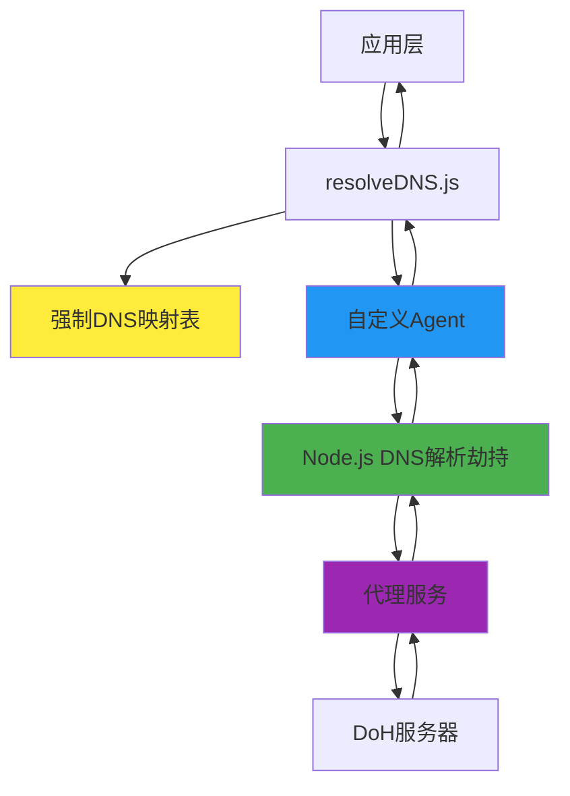

# ResolveDNS 强制 DNS 解析实现指南

## 概述

`resolveDNS.js` 是一个高级的 DNS 解析模块，实现了多层次的强制 DNS
解析机制。该模块不仅支持通过代理服务进行 DNS-over-HTTPS (DoH)
查询，还能够在底层网络层面强制映射特定域名到指定 IP
地址，确保在网络受限环境下的稳定运行。

## 核心技术架构

### 双层强制解析机制



### 技术实现层次

1. **应用层**: 高级 DNS 查询接口
2. **映射层**: 强制 DNS 映射表管理
3. **劫持层**: Node.js DNS 解析劫持
4. **传输层**: 自定义 HTTP Agent
5. **代理层**: 反向代理服务
6. **服务层**: DoH 服务器集群

## 强制 DNS 解析实现详解

### 1. 强制 DNS 映射表

```javascript
/**
 * 强制DNS映射表
 * 特定域名强制解析到指定IP地址
 */
const FORCED_DNS_MAPPING = {
  "fresh-reverse-proxy-middle.masx201.dpdns.org": "104.21.9.230",
};
```

**功能特点：**

- 🎯 **精确映射**: 强制将特定域名解析到指定 IP
- 🔒 **优先级最高**: 映射表优先级高于标准 DNS 解析
- ⚡ **即时生效**: 无需等待 DNS 缓存过期
- 🛡️ **绕过限制**: 绕过本地 DNS 污染和劫持

### 2. 自定义 DNS 劫持 Agent

```javascript
function createCustomAgent(hostname) {
  return new Agent({
    connect: {
      lookup: (hostname, options, callback) => {
        console.log(`🔍 正在解析: ${hostname}`);

        // 检查是否在强制映射表中
        if (FORCED_DNS_MAPPING[hostname]) {
          const forcedIP = FORCED_DNS_MAPPING[hostname];
          console.log(`🔒 强制DNS解析: ${hostname} -> ${forcedIP}`);

          // 支持单地址和地址数组返回
          if (options && options.all) {
            return callback(null, [{ address: forcedIP, family: 4 }]);
          } else {
            return callback(null, forcedIP, 4);
          }
        }

        // 对于其他域名，使用标准DNS解析
        lookup(hostname, options, callback);
      },
    },
  });
}
```

**技术原理：**

- 🔄 **函数劫持**: 拦截 Node.js 的 DNS 查询函数
- 🎛️ **条件路由**: 根据域名选择解析策略
- 📡 **兼容接口**: 保持与标准 DNS 接口的兼容性
- 🚀 **性能优化**: 避免不必要的网络请求

### 3. 强制解析流程

```javascript
export async function resolveDNS(domain, type = "AAAA", resolverUrl) {
  // 1. 参数验证
  if (!domain || typeof domain !== "string") {
    throw new Error("无效的域名参数");
  }

  // 2. 解析resolverUrl中的主机名
  const url = new URL(resolverUrl);
  const resolverHostname = url.hostname;

  // 3. 创建自定义Agent用于强制DNS解析
  const customAgent = createCustomAgent(resolverHostname);

  // 4. 构建请求URL
  url.searchParams.append("name", domain);
  url.searchParams.append("type", type);

  // 5. 发起强制DNS解析请求
  const response = await fetch(url.toString(), {
    dispatcher: customAgent,
    headers: {
      "User-Agent": "Mozilla/5.0 (compatible; DNS-Resolver/1.0)",
      "Accept": "application/json",
      "Cache-Control": "no-cache",
    },
  });

  return response.json();
}
```

## DoH 服务器强制解析实现

### 1. 代理层强制解析

当前的实现通过反向代理服务实现 DoH 服务器的强制访问：

```javascript
const resolverUrl =
  "https://fresh-reverse-proxy-middle.masx201.dpdns.org/token/4yF6nSCifSLs8lfkb4t8OWP69kfpgiun/https/dns.google/resolve";
```

**URL 结构分析：**

```
https://[代理服务器]/token/[认证令牌]/https://[DoH服务器地址]/[API路径]
```

### 2. 多 DoH 服务器故障转移

```javascript
const DOH_SERVERS = [
  {
    name: "Google DNS",
    url:
      "https://fresh-reverse-proxy-middle.masx201.dpdns.org/token/4yF6nSCifSLs8lfkb4t8OWP69kfpgiun/https/dns.google/resolve",
    priority: 1,
  },
  {
    name: "Cloudflare DNS",
    url:
      "https://fresh-reverse-proxy-middle.masx201.dpdns.org/token/4yF6nSCifSLs8lfkb4t8OWP69kfpgiun/https/cloudflare-dns.com/dns-query",
    priority: 2,
  },
  {
    name: "Quad9 DNS",
    url:
      "https://fresh-reverse-proxy-middle.masx201.dpdns.org/token/4yF6nSCifSLs8lfkb4t8OWP69kfpgiun/https/dns.quad9.net/dns-query",
    priority: 3,
  },
];

async function resolveDNSWithFallback(domain, type = "AAAA") {
  const errors = [];

  for (const server of DOH_SERVERS.sort((a, b) => a.priority - b.priority)) {
    try {
      console.log(`🔄 尝试使用 ${server.name} 进行解析...`);
      const result = await resolveDNS(domain, type, server.url);
      console.log(`✅ ${server.name} 解析成功`);
      return { result, server: server.name };
    } catch (error) {
      console.error(`❌ ${server.name} 解析失败:`, error.message);
      errors.push({ server: server.name, error: error.message });
      continue;
    }
  }

  throw new Error(`所有 DoH 服务器均不可用: ${JSON.stringify(errors)}`);
}
```

### 3. 智能 DoH 服务器选择

```javascript
class DoHServerManager {
  constructor() {
    this.serverStats = new Map();
    this.healthCheckInterval = 5 * 60 * 1000; // 5分钟
  }

  // 初始化服务器统计信息
  initializeServers(servers) {
    servers.forEach((server) => {
      this.serverStats.set(server.name, {
        ...server,
        successCount: 0,
        failureCount: 0,
        averageLatency: 0,
        lastUsed: null,
        isHealthy: true,
        lastHealthCheck: null,
      });
    });
  }

  // 获取最佳服务器
  getBestServer() {
    const healthyServers = Array.from(this.serverStats.values())
      .filter((server) => server.isHealthy)
      .sort((a, b) => {
        // 综合考虑成功率和延迟
        const aScore =
          (a.successCount / (a.successCount + a.failureCount)) * 100 -
          a.averageLatency;
        const bScore =
          (b.successCount / (b.successCount + b.failureCount)) * 100 -
          b.averageLatency;
        return bScore - aScore;
      });

    return healthyServers[0];
  }

  // 更新服务器统计
  updateServerStats(serverName, success, latency) {
    const stats = this.serverStats.get(serverName);
    if (stats) {
      if (success) {
        stats.successCount++;
        if (latency) {
          stats.averageLatency = (stats.averageLatency + latency) / 2;
        }
      } else {
        stats.failureCount++;
      }
      stats.lastUsed = Date.now();
    }
  }

  // 健康检查
  async healthCheck() {
    const promises = Array.from(this.serverStats.values()).map(
      async (server) => {
        try {
          const startTime = Date.now();
          const result = await resolveDNS("google.com", "A", server.url);
          const latency = Date.now() - startTime;

          this.updateServerStats(server.name, true, latency);
          server.isHealthy = true;
          server.lastHealthCheck = Date.now();

          console.log(`✅ ${server.name} 健康检查通过 (延迟: ${latency}ms)`);
        } catch (error) {
          this.updateServerStats(server.name, false);
          server.isHealthy = false;
          console.error(`❌ ${server.name} 健康检查失败:`, error.message);
        }
      },
    );

    await Promise.allSettled(promises);
  }

  // 启动定期健康检查
  startHealthCheck() {
    this.healthCheck();
    setInterval(() => this.healthCheck(), this.healthCheckInterval);
  }
}

// 使用示例
const dohManager = new DoHServerManager();
dohManager.initializeServers(DOH_SERVERS);
dohManager.startHealthCheck();

async function smartResolveDNS(domain, type = "AAAA") {
  const bestServer = dohManager.getBestServer();
  if (!bestServer) {
    throw new Error("没有可用的健康 DoH 服务器");
  }

  const startTime = Date.now();
  try {
    const result = await resolveDNS(domain, type, bestServer.url);
    const latency = Date.now() - startTime;
    dohManager.updateServerStats(bestServer.name, true, latency);
    return result;
  } catch (error) {
    dohManager.updateServerStats(bestServer.name, false);
    throw error;
  }
}
```

## 高级强制解析技术

### 1. 动态 DNS 映射

```javascript
class DynamicDNSMapping {
  constructor() {
    this.mappings = new Map();
    this.rules = [];
    this.updateInterval = 60 * 1000; // 1分钟
  }

  // 添加映射规则
  addRule(pattern, targetIP, options = {}) {
    this.rules.push({
      pattern: new RegExp(pattern),
      targetIP,
      priority: options.priority || 0,
      ttl: options.ttl || 300,
      expires: options.expires ? Date.now() + options.expires : null,
    });
  }

  // 动态解析域名
  resolve(hostname) {
    // 检查静态映射
    if (this.mappings.has(hostname)) {
      return this.mappings.get(hostname);
    }

    // 检查规则匹配
    for (const rule of this.rules.sort((a, b) => b.priority - a.priority)) {
      if (rule.pattern.test(hostname)) {
        if (rule.expires && Date.now() > rule.expires) {
          continue; // 跳过已过期的规则
        }

        console.log(`🎯 动态规则匹配: ${hostname} -> ${rule.targetIP}`);
        return rule.targetIP;
      }
    }

    return null;
  }

  // 更新映射表
  updateMapping(hostname, ip) {
    this.mappings.set(hostname, {
      address: ip,
      family: 4,
      timestamp: Date.now(),
    });
    console.log(`🔄 更新DNS映射: ${hostname} -> ${ip}`);
  }

  // 清理过期映射
  cleanup() {
    const now = Date.now();
    for (const [hostname, mapping] of this.mappings.entries()) {
      if (now - mapping.timestamp > 300000) { // 5分钟过期
        this.mappings.delete(hostname);
        console.log(`🗑️ 清理过期映射: ${hostname}`);
      }
    }
  }
}

// 集成到现有系统
const dynamicMapping = new DynamicDNSMapping();

// 添加动态规则
dynamicMapping.addRule(".*\\.dpdns\\.org", "104.21.9.230", { priority: 10 });
dynamicMapping.addRule("fresh-reverse-proxy-.*", "104.21.9.230", {
  priority: 8,
});
```

### 2. 加密 DNS 映射

```javascript
import crypto from "crypto";

class SecureDNSMapping {
  constructor(secretKey) {
    this.secretKey = secretKey;
    this.algorithm = "aes-256-gcm";
    this.mappings = new Map();
  }

  // 加密映射数据
  encrypt(data) {
    const iv = crypto.randomBytes(16);
    const cipher = crypto.createCipher(this.algorithm, this.secretKey);
    cipher.setAAD(Buffer.from("DNS-MAPPING", "utf8"));

    let encrypted = cipher.update(JSON.stringify(data), "utf8", "hex");
    encrypted += cipher.final("hex");

    const authTag = cipher.getAuthTag();

    return {
      encrypted,
      iv: iv.toString("hex"),
      authTag: authTag.toString("hex"),
    };
  }

  // 解密映射数据
  decrypt(encryptedData) {
    const decipher = crypto.createDecipher(this.algorithm, this.secretKey);
    decipher.setAAD(Buffer.from("DNS-MAPPING", "utf8"));
    decipher.setAuthTag(Buffer.from(encryptedData.authTag, "hex"));

    let decrypted = decipher.update(encryptedData.encrypted, "hex", "utf8");
    decrypted += decipher.final("utf8");

    return JSON.parse(decrypted);
  }

  // 安全存储映射
  setSecureMapping(hostname, ip) {
    const mappingData = {
      hostname,
      ip,
      timestamp: Date.now(),
      signature: crypto.createHmac("sha256", this.secretKey)
        .update(`${hostname}:${ip}:${Date.now()}`)
        .digest("hex"),
    };

    const encrypted = this.encrypt(mappingData);
    this.mappings.set(hostname, encrypted);
  }

  // 安全获取映射
  getSecureMapping(hostname) {
    const encrypted = this.mappings.get(hostname);
    if (!encrypted) return null;

    try {
      const decrypted = this.decrypt(encrypted);

      // 验证签名
      const expectedSignature = crypto.createHmac("sha256", this.secretKey)
        .update(`${decrypted.hostname}:${decrypted.ip}:${decrypted.timestamp}`)
        .digest("hex");

      if (decrypted.signature !== expectedSignature) {
        console.warn(`⚠️ 签名验证失败: ${hostname}`);
        return null;
      }

      return decrypted.ip;
    } catch (error) {
      console.error(`❌ 解密失败: ${hostname}`, error.message);
      return null;
    }
  }
}
```

### 3. 负载均衡强制解析

```javascript
class LoadBalancedDNSResolver {
  constructor(servers) {
    this.servers = servers.map((server, index) => ({
      ...server,
      index,
      weight: server.weight || 1,
      connections: 0,
      maxConnections: server.maxConnections || 100,
    }));
  }

  // 加权轮询选择服务器
  selectServer() {
    const availableServers = this.servers
      .filter((server) => server.connections < server.maxConnections)
      .sort((a, b) => {
        // 综合权重和当前连接数
        const aScore = a.weight / (a.connections + 1);
        const bScore = b.weight / (b.connections + 1);
        return bScore - aScore;
      });

    if (availableServers.length === 0) {
      throw new Error("所有服务器连接数已满");
    }

    return availableServers[0];
  }

  // 使用负载均衡解析
  async balancedResolveDNS(domain, type = "AAAA") {
    const server = this.selectServer();
    server.connections++;

    try {
      console.log(
        `🎯 选择服务器: ${server.name} (连接数: ${server.connections})`,
      );

      const result = await resolveDNS(domain, type, server.url);

      console.log(`✅ ${server.name} 解析成功`);
      return result;
    } finally {
      server.connections--;
    }
  }

  // 获取服务器状态
  getServerStats() {
    return this.servers.map((server) => ({
      name: server.name,
      connections: server.connections,
      maxConnections: server.maxConnections,
      utilization:
        ((server.connections / server.maxConnections) * 100).toFixed(2) + "%",
    }));
  }
}
```

## 实际应用场景

### 1. 企业网络环境

```javascript
// 企业内网 DNS 强制解析配置
const enterpriseMapping = {
  "internal-proxy.company.com": "192.168.1.100",
  "doh-proxy.company.com": "192.168.1.101",
  "backup-proxy.company.com": "192.168.1.102",
};

// 创建企业专用解析器
export function createEnterpriseResolver() {
  const enterpriseFORCED_MAPPING = {
    ...FORCED_DNS_MAPPING,
    ...enterpriseMapping,
  };

  return function createEnterpriseAgent(hostname) {
    return new Agent({
      connect: {
        lookup: (hostname, options, callback) => {
          if (enterpriseFORCED_MAPPING[hostname]) {
            const forcedIP = enterpriseFORCED_MAPPING[hostname];
            console.log(`🏢 企业DNS解析: ${hostname} -> ${forcedIP}`);
            return callback(null, forcedIP, 4);
          }
          lookup(hostname, options, callback);
        },
      },
    });
  };
}
```

### 2. 移动网络优化

```javascript
// 移动网络 DNS 优化
class MobileDNSOptimizer {
  constructor() {
    this.networkType = "unknown";
    this.carrierMapping = {};
    this.detectNetworkType();
  }

  // 检测网络类型
  async detectNetworkType() {
    try {
      // 通过特定域名解析判断运营商
      const result = await resolveDNS("carrier-detect.example.com", "A");
      this.networkType = this.identifyCarrier(result.Answer[0].data);
      this.setupCarrierMapping();
    } catch (error) {
      console.warn("网络类型检测失败，使用默认配置");
    }
  }

  // 识别运营商
  identifyCarrier(ip) {
    const carrierRanges = {
      "china-mobile": /^183\./,
      "china-unicom": /^123\./,
      "china-telecom": /^189\./,
    };

    for (const [carrier, pattern] of Object.entries(carrierRanges)) {
      if (pattern.test(ip)) {
        return carrier;
      }
    }
    return "unknown";
  }

  // 设置运营商特定映射
  setupCarrierMapping() {
    this.carrierMapping = {
      "china-mobile": {
        "doh-proxy.mobile.com": "211.136.112.50",
      },
      "china-unicom": {
        "doh-proxy.unicom.com": "123.125.81.2",
      },
      "china-telecom": {
        "doh-proxy.telecom.com": "202.96.134.133",
      },
    };
  }

  // 获取优化的解析器
  getOptimizedResolver() {
    const carrierConfig = this.carrierMapping[this.networkType] || {};

    return function createMobileAgent(hostname) {
      return new Agent({
        connect: {
          lookup: (hostname, options, callback) => {
            // 优先使用运营商特定映射
            if (carrierConfig[hostname]) {
              const optimizedIP = carrierConfig[hostname];
              console.log(`📱 运营商优化: ${hostname} -> ${optimizedIP}`);
              return callback(null, optimizedIP, 4);
            }

            // 回退到全局映射
            if (FORCED_DNS_MAPPING[hostname]) {
              const forcedIP = FORCED_DNS_MAPPING[hostname];
              console.log(`🔒 强制DNS解析: ${hostname} -> ${forcedIP}`);
              return callback(null, forcedIP, 4);
            }

            lookup(hostname, options, callback);
          },
        },
      });
    };
  }
}
```

## 监控和调试

### 1. 强制解析监控

```javascript
class DNSResolutionMonitor {
  constructor() {
    this.metrics = {
      totalQueries: 0,
      forcedResolutions: 0,
      failedQueries: 0,
      averageLatency: 0,
      resolutionsByDomain: new Map(),
      resolutionsByServer: new Map(),
    };
  }

  // 记录查询开始
  recordQueryStart(domain, server) {
    this.metrics.totalQueries++;
    return {
      domain,
      server,
      startTime: Date.now(),
      forced: !!FORCED_DNS_MAPPING[server],
    };
  }

  // 记录查询结果
  recordQueryEnd(queryContext, success, error = null) {
    const latency = Date.now() - queryContext.startTime;

    // 更新平均延迟
    this.metrics.averageLatency =
      (this.metrics.averageLatency * (this.metrics.totalQueries - 1) +
        latency) /
      this.metrics.totalQueries;

    // 记录强制解析
    if (queryContext.forced) {
      this.metrics.forcedResolutions++;
    }

    // 记录失败
    if (!success) {
      this.metrics.failedQueries++;
    }

    // 按域名统计
    const domainStats =
      this.metrics.resolutionsByDomain.get(queryContext.domain) || {
        count: 0,
        successCount: 0,
        averageLatency: 0,
      };
    domainStats.count++;
    if (success) domainStats.successCount++;
    domainStats.averageLatency =
      (domainStats.averageLatency * (domainStats.count - 1) + latency) /
      domainStats.count;
    this.metrics.resolutionsByDomain.set(queryContext.domain, domainStats);

    // 按服务器统计
    const serverStats =
      this.metrics.resolutionsByServer.get(queryContext.server) || {
        count: 0,
        successCount: 0,
        averageLatency: 0,
      };
    serverStats.count++;
    if (success) serverStats.successCount++;
    serverStats.averageLatency =
      (serverStats.averageLatency * (serverStats.count - 1) + latency) /
      serverStats.count;
    this.metrics.resolutionsByServer.set(queryContext.server, serverStats);
  }

  // 生成监控报告
  generateReport() {
    const successRate =
      ((this.metrics.totalQueries - this.metrics.failedQueries) /
        this.metrics.totalQueries * 100).toFixed(2);
    const forcedRate =
      (this.metrics.forcedResolutions / this.metrics.totalQueries * 100)
        .toFixed(2);

    return {
      summary: {
        totalQueries: this.metrics.totalQueries,
        successRate: `${successRate}%`,
        forcedResolutionRate: `${forcedRate}%`,
        averageLatency: `${this.metrics.averageLatency.toFixed(2)}ms`,
      },
      topDomains: Array.from(this.metrics.resolutionsByDomain.entries())
        .sort((a, b) => b[1].count - a[1].count)
        .slice(0, 10)
        .map(([domain, stats]) => ({
          domain,
          count: stats.count,
          successRate: `${
            (stats.successCount / stats.count * 100).toFixed(2)
          }%`,
          averageLatency: `${stats.averageLatency.toFixed(2)}ms`,
        })),
      serverPerformance: Array.from(this.metrics.resolutionsByServer.entries())
        .map(([server, stats]) => ({
          server,
          count: stats.count,
          successRate: `${
            (stats.successCount / stats.count * 100).toFixed(2)
          }%`,
          averageLatency: `${stats.averageLatency.toFixed(2)}ms`,
        })),
    };
  }
}

// 集成监控
const dnsMonitor = new DNSResolutionMonitor();

// 包装原有函数添加监控
export async function monitoredResolveDNS(domain, type = "AAAA", resolverUrl) {
  const url = new URL(resolverUrl);
  const server = url.hostname;

  const queryContext = dnsMonitor.recordQueryStart(domain, server);

  try {
    const result = await resolveDNS(domain, type, resolverUrl);
    dnsMonitor.recordQueryEnd(queryContext, true);
    return result;
  } catch (error) {
    dnsMonitor.recordQueryEnd(queryContext, false, error);
    throw error;
  }
}
```

## 最佳实践

### ✅ 推荐做法

1. **分层映射**: 建立多层次的 DNS 映射策略
2. **故障转移**: 实现自动故障转移和恢复机制
3. **性能监控**: 持续监控解析性能和成功率
4. **安全加固**: 使用加密和签名保护映射数据
5. **负载均衡**: 在多个服务器间智能分配负载
6. **缓存优化**: 实现智能缓存减少重复查询

### ❌ 避免做法

1. **硬编码配置**: 避免在代码中硬编码敏感信息
2. **单点故障**: 不要依赖单一服务器或代理
3. **忽略超时**: 设置合理的超时和重试机制
4. **缺乏监控**: 没有监控会导致问题难以发现
5. **过度强制**: 不要对所有域名都使用强制解析

## 故障排除

### 常见问题诊断

1. **映射表不生效**
   ```javascript
   // 调试映射表
   console.log("当前映射表:", FORCED_DNS_MAPPING);
   console.log("检查域名匹配:", hostname in FORCED_DNS_MAPPING);
   ```

2. **Agent 创建失败**
   ```javascript
   // 验证 Agent 配置
   try {
     const testAgent = createCustomAgent("test.example.com");
     console.log("✅ Agent 创建成功");
   } catch (error) {
     console.error("❌ Agent 创建失败:", error.message);
   }
   ```

3. **网络连接问题**
   ```javascript
   // 测试基础连接
   async function testConnection(url) {
     try {
       const response = await fetch(url, { method: "HEAD" });
       console.log(`✅ 连接测试成功: ${response.status}`);
     } catch (error) {
       console.error(`❌ 连接测试失败:`, error.message);
     }
   }
   ```

通过以上技术实现，`resolveDNS.js` 提供了完整的多层次强制 DNS
解析解决方案，能够在各种复杂的网络环境下稳定运行。
